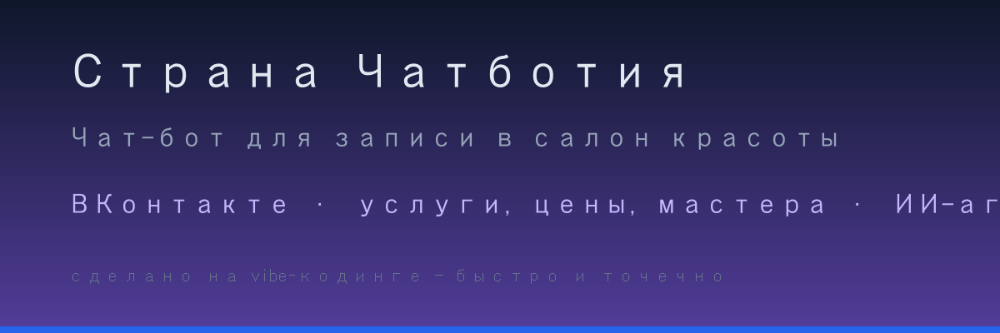
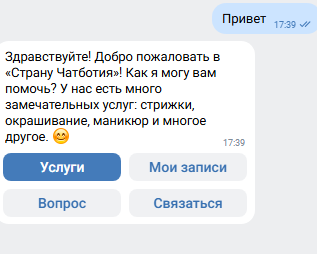
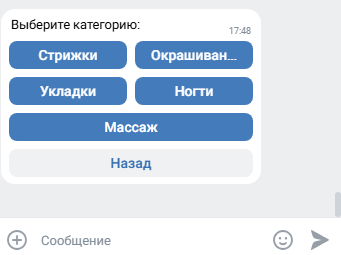
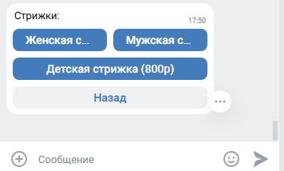
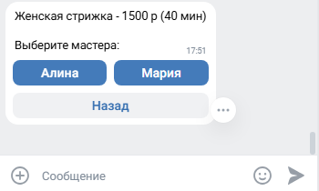
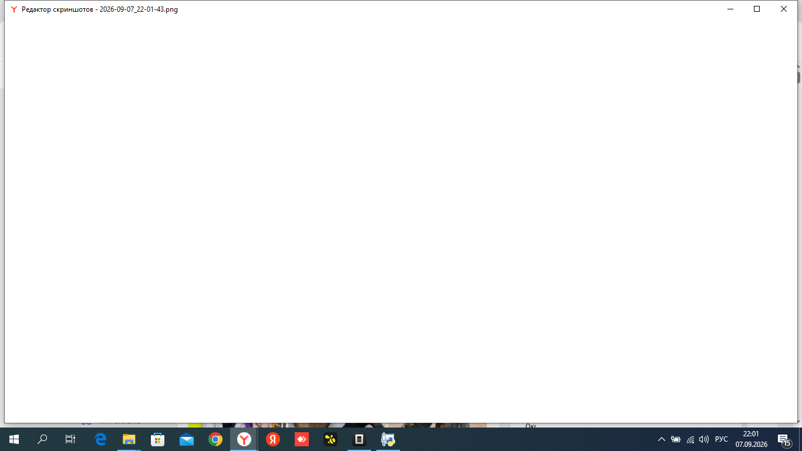

# Виртуальный администратор салона красоты «Страна Чатботия»



Учебный пример чат-бота для сообщества ВКонтакте, который сам записывает клиентов на услуги.

<div align="center">

**Запись клиентов · меню услуг · ИИ-агент с юмором · журнал записей**

</div>

## Зачем этот бот

Клиент не любит ждать ответа «администратора онлайн». Бот отвечает мгновенно, 24/7:

- показывает **услуги, цены и мастеров** из базы знаний;
- ведёт по шагам: услуга → мастер → дата → время → имя → телефон;
- запоминает запись и **уведомляет администратора**;
- на вопросы вне меню отвечает **ИИ-агент** — весело, но по делу.

## Как это выглядит (скриншоты)

<div align="center">
  <p><b>Приветствие</b></p>
  
  <p><b>Меню категорий</b></p>
  
  <p><b>Выбор услуги</b></p>
  
  <p><b>Выбор мастера</b></p>
  
  <p><b>Вопрос ИИ-агенту</b></p>
  
</div>

## Возможности

| Функция | Описание |
|---|---|
| 🗓 Запись | Полный сценарий: услуга → мастер → дата → время → подтверждение |
| 💬 ИИ-агент | Отвечает на вопросы текстом, с добрым юмором, строго по базе знаний |
| 💳 Цены | Все услуги с ценами и длительностью из `knowledge_base.md` |
| 📋 Журнал | Записи сохраняются и передаются администратору |
| ⚠️ Валидация | Имя не цифрами, телефон — 11 цифр, защита от ошибок |
| 🔔 Напоминание | Учебный сценарий: сообщение клиенту накануне визита |

## Пользователь

Владелец салона красоты и его клиенты в сообществе ВКонтакте.

## Стек

Python · vk_api (Bot Longpoll) · ProxyAPI (ИИ-агент) · python-dotenv · requests

## Как запустить

1. Установите Python 3.10+ (галочка «Add Python to PATH»).
2. Установите зависимости:

   ```
   pip install -r requirements.txt
   ```

3. Скопируйте `.env.example` → `.env` и заполните:

   | Переменная | Что вписать |
   |---|---|
   | `VK_TOKEN` | токен сообщества (0 → Социальные → Сообщения) |
   | `VK_GROUP_ID` | ID сообщества в VK |
   | `PROXY_API_KEY` | ключ ProxyAPI для ИИ-агента |
   | `ADMIN_ID` | ваш ID VK для уведомлений |

4. Запустите:

   ```
   python main.py
   ```

## Структура проекта

```
main.py              логика бота
config.py            чтение настроек из .env
knowledge_base.md    услуги, цены, мастера, FAQ
system_prompt.md     системный промпт для ИИ-агента
.env.example         шаблон настроек (скопировать в .env)
requirements.txt     зависимости
```

## ВАЖНО

- Файл `.env` с токенами **не публикуйте** — он только у вас.
- ИИ-агент отвечает строго по `knowledge_base.md`, ничего не выдумывает.
- Это учебный демо-пример: бот может быть адаптирован под любой бизнес с записью клиентов.